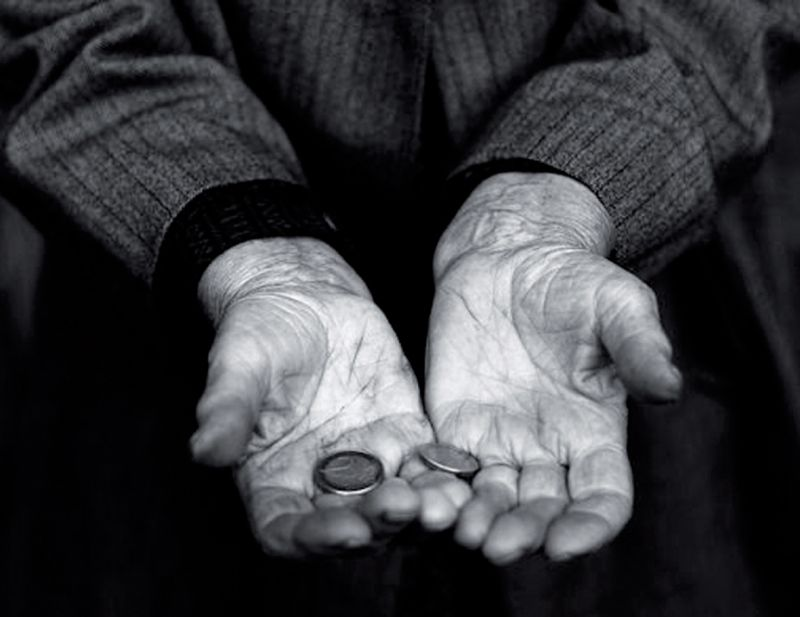

```{r setup, echo=FALSE, results='hide', message=FALSE, warning=FALSE}
source('lib/libraries.r', encoding='UTF-8')
Sys.setlocale('LC_ALL', 'Slovenian')
```


```{r studio, echo=FALSE, results='asis'}
source('lib/rstudio.r', encoding='UTF-8')
```
<center>

</center>

# Uvodna beseda

Prikazal bom stopnjo in prag tveganja revščine v Sloveniji. Prikazal bom, kakšno je tveganje po statističnih regijah skozi čas in kako na tveganje vplivajo stopnja izobrazbe, starost in velikost družine. Primerjal bom spola in prikazal podobnosti ter razlike. 

# Obdelava, uvoz in čiščenje podatkov

```{r uvoz, echo=FALSE, message=FALSE, warning=FALSE}
source("uvoz/uvoz.r", encoding="UTF-8")
```


Uvozil sem podatke o revščini v obliki CSV s statističnega urada. 
Podatke imam v štirih razpredelnicah v obliki *tidy data*, ki sem jih dejansko razbil na 34 razpredelnic po letih.


```{r izobrazba1, echo=FALSE}
kable(head(izobrazba1))
```


```{r regije1, echo=FALSE}
kable(head(regije1))
```

STOPNJA TVEGANJA REVŠČINE je odstotek oseb, ki živijo v gospodinjstvih z ekvivalentnim (neto) razpoložljivim dohodkom, nižjim od praga tveganja revščine. PRAG TVEGANJA REVŠČINE se določi (izračuna) kot 60 % mediane ekvivalentnega (neto) razpoložljivega dohodka vseh gospodinjstev. Za izračun EKVIVALENTNEGA DOHODKA (dohodka na ekvivalentnega odraslega člana gospodinjstva) se uporablja prilagojeno OECD-jevo ekvivalenčno lestvico. Lestvica daje prvemu odraslemu članu utež 1, otrokom, mlajšim od 14 let, utež 0,3, drugim članom, starim 14 ali več let, pa utež 0,5. [@SURS]

```{r prag1, echo=FALSE}
kable(head(prag1))
```

PRAG TVEGANJA REVŠČINE je opredeljen s 60 % mediane ekvivalentnega neto razpoložljivega dohodka vseh gospodinjstev ob upoštevanju OECD-jeve prilagojene ekvivalenčne lestvice.
Lestvica daje prvemu odraslemu članu utež 1, otrokom, mlajšim od 14 let, utež 0,3, drugim članom, starim 14 let ali več, pa utež 0,5. Štiričlansko gospodinjstvo dveh odraslih in dveh otrok ima tako 2,1 ekvivalentnega odraslega člana (izračun: 1x1+1x0,5+2x0,3=2,1), dvočlansko gospodinjstvo dveh odraslih oseb pa 1,5 ekvivalentnega člana (izračun: 1x1+1x0,5=1,5). 
EKVIVALENTNI DOHODEK (dohodek na ekvivalentnega odraslega člana gospodinjstva) se izračuna tako, da se sešteje dohodke vseh članov gospodinjstva in nato deli s številom ekvivalentnih odraslih članov v gospodinjstvu. [@SURS]

#Analiza in vizualizacija
###Prag tveganja revščine
```{r vizualizacija, echo=FALSE, message=FALSE, error=FALSE, warning=FALSE, results='hide'}
source("vizualizacija/vizualizacija.r", encoding='UTF-8')
```


```{r graf.prag.tveganja, echo=FALSE, error=FALSE, message=FALSE, warning=FALSE, fig.align='center', fig.height=7, fig.width=10}
plot(graf.prag.tveganja)
```

Iz grafa lahko razberemo, da je prag tveganja lepo rastel vse do gospodarske krize, leta 2008. Takrat je celo malce padel, potem pa vse do danes stagniral z manjšimi spremembami. Na grafu so prikazane 3 krivulje, ki prikazujejo različne vrste gospodinjstev. Na vseh opazimo iste trende. Ker gre za utežene povprečne letne plače glede na družinske člane, se krivulje razlikujejo le za konstante.

```{r analiza, echo=FALSE, message=FALSE, error=FALSE, warning=FALSE, results='hide'}
source('analiza/analiza.r', encoding='UTF-8')
```


###Napoved praga tveganja revščine
```{r graf.napovedi.praga, echo=FALSE, error=FALSE, message=FALSE, warning=FALSE, fig.align='center', fig.height=7, fig.width=10}
plot(graf.napovedi.praga)
```

Zgoraj sem pripravil model, ki prikazuje napoved za prag tveganja revščine med leti 2018 in 2020. Kot podatke sem vzel leta 2005-2017, pri čemer pa se vidi hitra rast praga tik pred krizo v letih 2005-2008. To nam prikaže malce nerealne napovedi, zato sem zanemaril prva tri leta in pripravil nov model(spodaj), ki prikazuje realnejše napovedi. 

```{r graf.napovedi.praga.realne, echo=FALSE, error=FALSE, message=FALSE, warning=FALSE, fig.align='center', fig.height=7, fig.width=10}
plot(graf.napovedi.praga.realne)
```

###Stopnja tveganja po regijah


```{r shiny, echo=FALSE, error=FALSE, message=FALSE, warning=FALSE, fig.align='center', fig.height=7, fig.width=10}
shinyAppDir("shiny", options=list(width="100%", height=600))
```

Iz zgornjih zemljevidov lahko spremljamo spremembe stopnje tveganja revščine po statističnih regijah. Opazimo, da se je najbolj stanje izboljšalo v severovzhodnem delu države, predvsem v pomurski regiji.V južni in jugovzhodni Sloveniji je skozi čas stopnja tveganja stagnirala, stanje pa se je poslabšalo predvsem na Gorenjskem.


###Primerjava spolov
```{r graf.prag.tveganja.izobrazba.s, echo=FALSE, error=FALSE, message=FALSE, warning=FALSE, fig.align='center', fig.height=7, fig.width=10}
plot(graf.prag.tveganja.izobrazba.s)
```

Iz zgornjega grafa razberemo, da so ženske bolj naklonjene tveganju revščine, neglede na izobrazbo. Izjema so bile ženske z visokošolsko ali višješolsko izbrazbo do leta 2013. Dober znak iskanja ravnovesja med spoloma, je to, da se razlike v tveganju skozi leta vedno manjše.

###Stopnja tveganja revščine in stopnja registrirane brezposelnosti
```{r graf.prag, echo=FALSE, error=FALSE, message=FALSE, warning=FALSE, fig.align='center', fig.height=7, fig.width=10}
graf.prag
```

Zgornji graf primerja stopnjo registrirane brezposelnosti in stopnjo tveganja revščine skozi leta po statističnih regijah.
Kot smo ugotovili že pri zemljevidu, se je stanje glede stopnje tveganja revščine najbolj izboljšalo v pomurski regiji, vendar se je hkrati tam zvišala tudi stopnja registrirane brezposelnosti. Iz tega bi lahko sklepal, da so v tem delu zaprli mnogo delovnih mest z nižjimi plačami in odprli manj delovnih mest z višjimi plačami. Če se osredotočimo še na osrednjo Slovenijo, vidimo, da se je po krizi pa vse do leta 2014 stanje glede brezposelnosti in sopnje tveganja revščine slabšalo. Po letu 2014, se opazi izboljšanje glede stopnje brezposelnosti, kasneje pa tudi glede stopnje tveganja revščine. Stanje pa se še ni povrnilo v prvotno(pred krizo).

#Zaključna beseda

Ugotovil sem, da se po šoku zaradi krize stopnja tveganja revščine ponovno zmanjšuje, kar povečuje blaginjo naše države. Izravnavajo se tudi razlike med spoloma na tem področju, ki so bile v preteklosti občutno večje. Pravtako se izravnavajo razlike med regijami. Napovedi kažejo na nadaljno rast meje praga tveganja revščine.

#References


